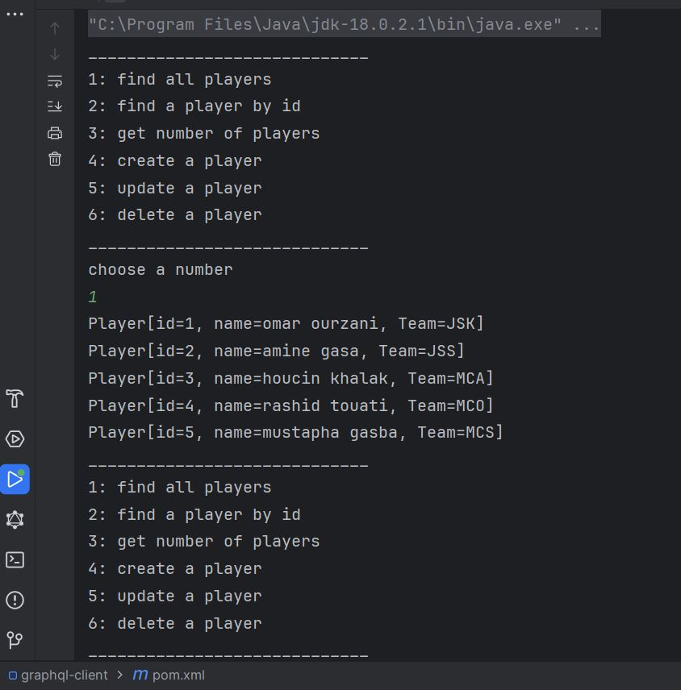

# Interacting with spring boot graphql project using Java and HTTP requests
this project used Java console mode to interact with a spring boot graphql project, it performs all CRUD (Create, Read, Update, Delete) operations.

each player is characterized by:
- id.
- name.
- team.

the java client graphql side allows you:

1. find all players.
2. find a player by id.
3. get the number of players.
4. create a player.
5. update a player.
6. delete a player.

### video to interact with spring boot graphql project through graphiql dashboard and HTTP post request.
https://www.youtube.com/watch?v=KpqWrvCAjsw

### video explanation for java graphql client side. 

# screenshot

